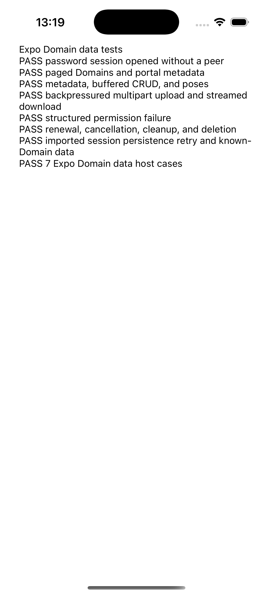

# Domain data platform validation

This records the SDK-only completion work for [#388](https://github.com/aukilabs/auki-sdk/pull/388)
and [#374](https://github.com/aukilabs/auki-sdk/issues/374). Backend source and
configuration were inspected read-only on 2026-09-15. No provider contracts,
deployment configuration, or shared data were changed.

## Provider compatibility

Known-Domain imported-session data uses the existing contract:

1. `POST /service/domains-access-token`, with the imported bearer and no query.
2. `POST /api/v1/domains/{id}/auth`, with the returned service bearer.
3. The selected Domain Server, with its DDS-issued Domain grant.

API `main` was `d388b2f6`; release `v0.8.2` was `da6dbbc`. Its
[service-token implementation](https://github.com/aukilabs/api/blob/d388b2f6/pkg/api/service.go)
projects imported identities into existing User/App token profiles. A viewer
receives an App-shaped token with an opaque human subject; other human roles
receive a User-shaped token with the provider's allowed Domain set. This is a
coarse role projection, not a complete per-operation policy contract. DDS and
the Domain Server retain their own permission checks.

The listing proposal in #374's 2026-09-15 comment depends on
`?purpose=p2p` in [API #415](https://github.com/aukilabs/api/pull/415), which was
closed without merging on 2026-09-08. Remote branch
`feature/zitadel-read-admission` at `6b45246b` contains that proposal; remote
`main` does not. Feature CI builds use a feature image tag, while release
deployment runs on version tags. This is not evidence that the proposed
exchange is deployed.

The ordinary exchange cannot safely replace it for every imported role.
DDS's [Domain handlers](https://github.com/aukilabs/domain-service/blob/c2230120/dds/http/domain.go)
require a UUID App subject on `/accessible-domains`. On the older `/domains`
route, the opaque viewer subject can skip App permission filtering and expose
the organization's broader catalog. The SDK therefore rejects imported listing
and portal-to-Domain association queries before network I/O. It never silently
substitutes organization listing. Known-Domain portal, pose, and data operations
remain available with the server's permissions.

DDS `/accessible-domains` was introduced at `45ded2e6` / `v0.14.3`; inspected
source was `c2230120` / `v0.14.4`. Inspected deployment configuration pins
staging/production DDS to `v0.13.3`. API staging uses `v0.8.2` with policy
authentication; production uses `v0.7.3` without that setting. Dev uses `latest`.
Configuration and source support are not proof of current rollout. Validate the
target environment before claiming imported data or listing compatibility.

## Local validation

All new tests use synthetic credentials and local HTTP or Fetch fixtures.
The implementation reuses the core Domain client and session refresh owner
on each platform.

| Check | Result |
| --- | --- |
| `cargo build --locked -p auki-sdk` | Passed |
| `cargo test --locked -p auki-auth -p auki-domain-client -p auki-sdk -p auki-tasks -p auki-dms --quiet` | 277 passed |
| `cargo clippy --locked -p auki-auth -p auki-domain-client -p auki-sdk --all-targets -- -D warnings` | Passed |
| `cargo clippy --locked -p auki-auth -p auki-domain-client -p auki-sdk -p auki-sdk-web --target wasm32-unknown-unknown --features auki-sdk-web/finite-protocols,auki-sdk-web/message,auki-sdk-web/stream -- -D warnings` | Passed |
| `cargo clippy --locked -p auki-sdk-web --target wasm32-unknown-unknown --features finite-protocols,message,stream --all-targets -- -D warnings` | Passed |
| Web binding `npm ci`, `npm run check`; `npx tsc --noEmit` after the new error-code example | Passed |
| `WASM_BINDGEN_TEST_RUNNER=<0.2.121 runner> bash test-support/run-domain-data-browser-tests.sh` | 7 Chromium tests passed |
| Portable Echo Web `npm ci`, `npm run check` | Passed |
| Python `maturin develop --locked --manifest-path core/bindings/python/auki-sdk-py/Cargo.toml` | Passed in the binding's virtual environment |
| Same Python build with `--no-default-features`, then the peer-facade surface case plus `test_domain_data.py` and `test_zitadel_session.py` | 9 passed |
| `python -m pytest core/bindings/python/auki-sdk-py/python_tests -q` | 90 passed; App denial regression also rerun after making its operations sequential |
| `PYO3_PYTHON=<venv>/bin/python cargo test --locked -p auki-sdk-py --lib --quiet` | 34 passed |
| `PYO3_PYTHON=<venv>/bin/python cargo clippy --locked -p auki-sdk-py --all-targets -- -D warnings` | Passed |
| `cargo test --locked -p auki-sdk-swift --lib` | 17 passed |
| `cargo clippy --locked -p auki-sdk-swift --all-targets --features standard-protocols -- -D warnings` | Passed |
| `bash core/bindings/swift/auki-sdk-swift/build-xcframework.sh` | All three iOS slices built; generated Swift typecheck and framework validation passed |
| `bash test-support/run-zitadel-swift-bindings.sh` | 8 generated Swift imported-session runtime cases passed |
| `bash core/bindings/swift/auki-sdk-swift/run-domain-data-bindings-test.sh` | Generated Swift User/imported Domain data runtime passed; one multipart completion, one abort, zero outstanding uploads, only the seed record retained |
| Expo `npm run build`, `npm run typecheck`, `npm run test:domain-data` | Passed, including the final Web error-code mapping |
| Expo `bash scripts/run-domain-data-expo-web.sh` | 7 actual Metro/Chromium/WASM cases passed |
| CocoaPods `AukiSdkExpo` Release compile and full Expo/Hermes Release simulator app build | Passed against the regenerated XCFramework |
| Expo `AUKI_DOMAIN_DATA_IOS_APP=<built app> bash scripts/run-domain-data-expo-ios.sh` | 7 actual iOS simulator cases passed |
| `cargo fmt --all -- --check`, `git diff --check`, documentation and script checks | Passed; 53 local Markdown links, 14 heading anchors, all 5 changed shell scripts, and Python/JavaScript fixture syntax |

Native imported-session regressions cover distinct data/peer credentials,
wrong issuer/audience/Domain/expiry, denied writes/deletes, one concurrent
refresh, awaited persistence and retained-generation retry, cached-grant
persistence checks, repeated authentication rejection, cancellation, and
logout draining a pending save. Browser tests exercise the actual generated
WASM binding, streaming/abort cleanup, error codes, and credential-store
promises. Browser requests are intercepted with synthetic Fetch responses.

Python covers imported-session save failure and recovery, cancellation while
saving, denied/wrong-Domain data, and listing rejection. App coverage verifies
explicit service endpoints, gateway MAC validation and propagation, a single
service-token renewal after DDS 401, and preserved write/delete 403 responses.
The minimal build excludes optional application protocols. Two protocol-only
surface assertions failed when initially included in that minimal selection;
they pass in the full default-feature suite. The documented minimal selection
above exercises the SDK facade and both data/authentication suites:

~~~sh
python -m pytest \
  core/bindings/python/auki-sdk-py/python_tests/test_surface.py::test_module_exposes_the_small_peer_facade \
  core/bindings/python/auki-sdk-py/python_tests/test_domain_data.py \
  core/bindings/python/auki-sdk-py/python_tests/test_zitadel_session.py -q
~~~

The [shared loopback fixture](domain-data-local-fixture.mjs) serves separate
DDS and Domain Server listeners for the generated Swift and Expo runtime
checks. It never forwards requests, and its diagnostic counters exclude
credentials and request bodies.

Expo runtime cases cover User login without a peer, DDS 401 renewal, real
Domain pages, portal/pose lookup, metadata/CRUD, streamed upload/download,
explicit EOF, HTTP 403, cancellation during a pending source callback,
multipart abort/drain, and deletion of all test records. The imported case
checks an expired login, failed awaited save, identical retained-snapshot
retry with one refresh, successful known-Domain data, zero-I/O listing
rejection, and client/session close. Runtime checks caught and fixed Swift's
ambiguous `Double.init` conversion for upload chunk limits and an Expo adapter
that prematurely supplied EOF.

Expo commands run from `core/bindings/expo`. The checked-in
`scripts/build-domain-data-expo-ios.sh` reproduces the simulator build. This
run used an equivalent already-prepared Release project under
`target/domain-data-expo-ios-prebuilt/DerivedData/`. Runtime artifacts are in
`output/playwright/domain-data-expo-web-72496/` and
`target/domain-data-expo-ios-app/run-72410/`. Browser, fixture processes, and
the isolated simulator were cleaned up. Physical iOS hardware and Android
were not tested; Android remains outside the binding's supported scope.

Expo/Hermes iOS simulator results

The Rust data API and provider wire formats are unchanged. Binding APIs are
additive, including a structured Swift Domain data error case. Regenerate the
Swift bindings and XCFramework together; consumers with exhaustive error
switches must handle the new case. Existing Swift login calls retain default
arguments. Python's imported-session constructor runs inside the asyncio loop
that owns its async store callback.

## Shared environment validation

The earlier #388 validation records dev User data round trips on filesystem
`v0.14.6` and S3 `v0.14.2`: Python transferred 17 MiB, Chromium transferred
16 MiB with byte checks, and native Rust shared the credential with a peer.
Portal/pose reads and temporary-record cleanup passed. These are inherited
results; they were not rerun during this SDK completion work.

[#391](https://github.com/aukilabs/auki-sdk/pull/391) and the closed
[#375](https://github.com/aukilabs/auki-sdk/issues/375) already record approved dev
compute/robot validation at SDK `95ef3b1c`: data exchange, direct/relay peers,
renewal across expiry and idle boundaries, denied idle writes/deletes and
wrong-Domain access, cancellation, and cleanup. That evidence covers the
machine data adapters, not imported ZITADEL or App credentials.

The user approved the proposed live operation scope below; execution is still
waiting for credential-file or secret-loader references, aligned environment
URLs, and designated Domain IDs. No live checks were run during this work.
Imported sessions must have the SDK as their sole refresh owner during the run.

Run a unique-record round trip
(write, read, replace, multipart upload/download, delete), then denied-operation
checks with restricted credentials and a designated inaccessible Domain. Only
delete records created by that run. Preserve returned HTTP status and redact
credentials. Do not provision roles, Apps, Domains, robots, or compute nodes as
part of SDK validation.

Safe imported-session listing cannot satisfy #374's current checklist without
a supported provider contract or an explicit change to the issue's scope.
No backend implementation is included in this SDK change.
